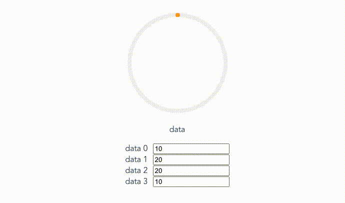

# vue-cumulative-circle

> Vue Cumulative Circle Component

## Demo


## Usage
```
import Vue from 'vue'
import App from './App'
import CumulativeCircle from "./CumulativeCircle.vue";

Vue.use(CumulativeCircle);

Vue.config.productionTip = false

new Vue({
  render: (h) => h(App),
}).$mount("#app");
```

## Example

```
<template>
  <div id="app">
    <cumulative-circle :size="200"
                      :stroke-width="8"
                      v-model="data"/>
    <div>
      <p>data</p>
      <div><label>data 0</label><input v-model="data[0].percentage"></div>
      <div><label>data 1</label><input v-model="data[1].percentage"></div>
      <div><label>data 2</label><input v-model="data[2].percentage"></div>
      <div><label>data 3</label><input v-model="data[3].percentage"></div>
    </div>
  </div>
</template>

<script>
import CumulativeCircle from "./CumulativeCircle";
export default {
  name: 'App',
  components: {
    CumulativeCircle
  },
  data() {
    return {
      data: [
        {
          color: '#ffa10e',
          percentage: 10
        },
        {
          color: '#1886ff',
          percentage: 20
        },
        {
          color: 'red',
          percentage: 20
        },
        {
          color: 'blue',
          percentage: 10
        }
      ]
    }
  }
}
</script>
```

| Prop       | Type       | Description   | default  |
| ------------- |:-------------:| -----:| -----:|
| `value` | `Array` | object array(property: color, percentage)   | $1600 |
| `size`      | `Number`     |  component size (w x h) | 200 |
| `strokeWidth` | `Number`     | circle bar width | 8 |
| `ringColor` | `String`     |  default ring color | f2f2f2 |
